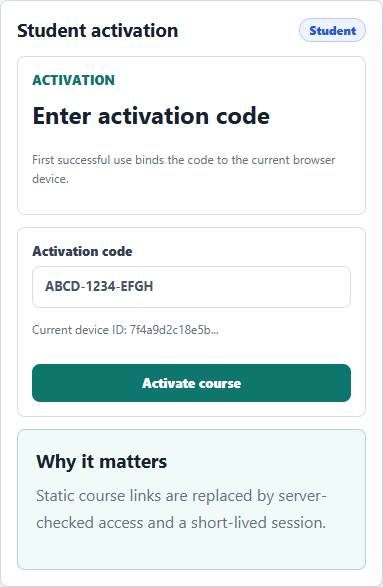
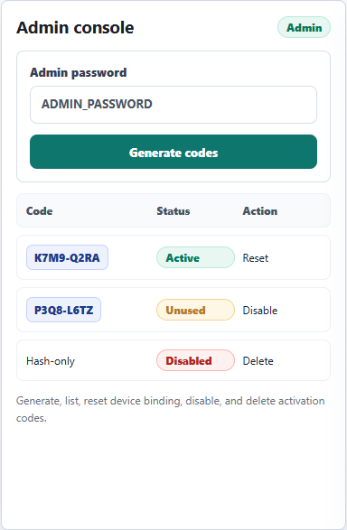
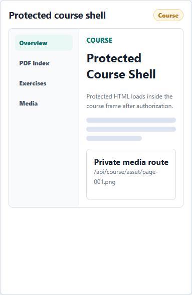

# Smart Course Platform

A protected course delivery template with activation codes, device binding, admin console, Next.js, Supabase, and Vercel.

[](https://frido0319.github.io/smart-course-platform-public/)


[Live static demo](https://frido0319.github.io/smart-course-platform-public/) | [Admin docs](docs/ADMIN.md) | [Deployment docs](docs/DEPLOYMENT.md) | [Promotion copy](docs/PROMOTION.md)

This repository is a public, slimmed-down version of a paid interactive course platform. It keeps the application architecture, admin workflow, protected course routes, deployment notes, and a small demo course shell. Private paid course media, extracted PDF page images, and full course datasets are intentionally excluded.

## Preview

| Student activation | Admin console | Protected course shell |
| --- | --- | --- |
|  |  |  |

## What It Does

- Lets students enter activation codes before viewing a course.
- Binds the first successful activation to the current browser device id.
- Rejects access when a code is disabled, expired, bound to another device, or not active.
- Serves protected course HTML from `/api/course/html`.
- Rewrites course media paths to `/api/course/asset/...` and checks authorization before serving media.
- Provides a full admin console for generating, listing, resetting device bindings, disabling, and deleting activation codes.
- Stores activation state and access logs in Supabase.

## Why This Is Useful

- Course creators can avoid shipping paid course assets as public static files.
- Students get a simple activation-code flow instead of a full account system.
- Admins get practical operations for code generation, revocation, device reset, and cleanup.
- The public template stays small while documenting how private media can live outside Git.

## Admin Console

The admin console is a core feature of this project, not a temporary maintenance tool. It includes:

- code generation with optional internal notes,
- activation-code listing,
- bound-device visibility,
- device-binding reset,
- disabling revoked codes,
- deletion for mistaken or expired test codes.

Admin routes are kept under `/admin` and `/api/admin/...`; they require `ADMIN_PASSWORD` through the `x-admin-password` header.

## Demo Scope

The included course is only a compact demonstration shell:

```text
protected-content/smart-manufacturing/smart_manufacturing_interactive_guide.html
```

The production/private version can keep large folders outside Git and upload them to private Supabase Storage:

```text
protected-content/smart-manufacturing/source_pages/
protected-content/smart-manufacturing/source_pages_full/
protected-content/smart-manufacturing/source_pages_cn/
```

## Architecture

```text
src/app/                    Next.js App Router pages and API routes
src/app/admin/              Admin UI for activation-code management
src/app/api/admin/          Admin APIs for code operations
src/app/api/activate/       Student activation API
src/app/api/course/         Protected HTML, manifest, and asset APIs
src/lib/                    Auth, session, Supabase, course-content helpers
protected-content/          Server-side protected demo course shell
scripts/                    Local restart, tests, and asset-upload utility
supabase/schema.sql         Base database schema
docs/                       Operations and deployment documentation
```

## Local Setup

Install dependencies:

```bash
npm install
```

Create `.env.local` from `.env.example` and fill the values:

```env
NEXT_PUBLIC_APP_URL=http://localhost:3050
SUPABASE_URL=
SUPABASE_SERVICE_ROLE_KEY=
SESSION_SECRET=replace-with-at-least-32-random-characters
ADMIN_PASSWORD=replace-with-a-strong-admin-password
```

Run the app:

```bash
npm run dev -- --port 3050
```

Open:

```text
http://localhost:3050
http://localhost:3050/admin
```

## Useful Commands

```bash
npm run test:course
npm run lint
npm run build
npm run restart:local
npm run upload:smart-assets
```

`upload:smart-assets` reads `.env.local` and uploads private course media folders to the `smart-course-assets` Supabase Storage bucket.

## Security Notes

- Do not commit `.env.local`.
- Do not expose `SUPABASE_SERVICE_ROLE_KEY` to client code.
- Do not hard-code a real admin password.
- Do not commit paid course images or extracted course datasets.
- The system protects against casual file/link/account sharing. It does not prevent screenshots or screen recording.

## Documentation

- [Admin Operations](docs/ADMIN.md)
- [Deployment](docs/DEPLOYMENT.md)
- [Course Content](docs/COURSE_CONTENT.md)
- [Security Model](docs/SECURITY_MODEL.md)
